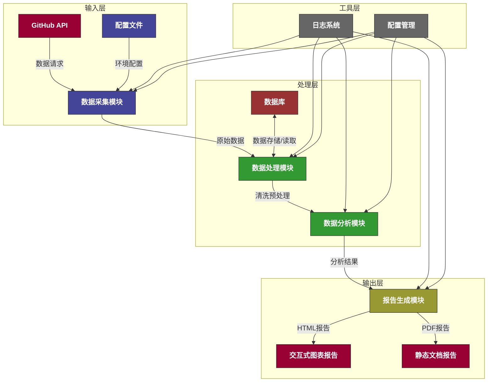
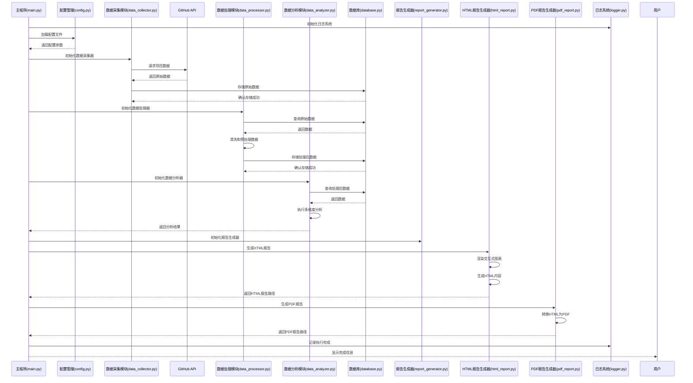

# GitHub开源项目分析系统

## 项目简介

GitHub开源项目分析系统是一个强大的工具，用于自动收集、分析和生成关于GitHub开源项目的详细报告。该系统通过GitHub API获取项目数据，进行深入分析，并生成美观的HTML和PDF格式报告，帮助用户了解开源生态系统的趋势和洞察。

## 功能特点

- **自动化数据采集**：通过GitHub API收集项目信息、语言分布、贡献者数据等
- **多维度数据分析**：
  - 编程语言分布分析
  - 贡献者地域和活跃度分析
  - 项目领域分类和趋势
  - 项目生命周期和健康度评估
- **交互式报告生成**：
  - 美观的HTML报告，支持动态图表
  - PDF格式报告，便于分享和存档
- **Docker支持**：容器化部署，简化环境配置

## 系统架构

### 系统流程图



### 系统执行时序图



### 核心模块

1. **数据采集模块** (`src/data_collection/`)
   - `github_api.py` - GitHub API交互封装
   - `data_collector.py` - 数据采集和存储逻辑

2. **数据处理模块** (`src/data_processing/`)
   - `data_analyzer.py` - 核心数据分析逻辑
   - `data_processor.py` - 数据清洗和预处理

3. **报告生成模块** (`src/reporting/`)
   - `report_generator.py` - 报告生成协调器
   - `html_report.py` - HTML报告生成器
   - `pdf_report.py` - PDF报告生成器

4. **工具模块** (`src/utils/`)
   - `database.py` - 数据库连接管理
   - `logger.py` - 日志管理
   - `config.py` - 配置管理

## 安装和使用

### 本地安装

1. 克隆仓库：
```bash
git clone <repository-url>
cd analyze_github
```

2. 安装依赖：
```bash
pip install -r requirements.txt
```

3. 配置环境变量：
   - 创建`.env`文件，添加GitHub API token：
   ```
   GITHUB_API_TOKEN=your_github_token_here
   ```

4. 运行主程序：
```bash
python main.py
```

### Docker部署

1. 构建Docker镜像：
```bash
docker-compose build
```

2. 运行容器：
```bash
docker-compose up
```

3. 查看生成的报告：
   - HTML报告：`output/github_analysis_report.html`
   - PDF报告：`output/github_analysis_report.pdf`

## 测试报告生成功能

可以使用提供的测试脚本来验证报告生成功能：

```bash
python test_report.py
```

该脚本会使用模拟数据生成HTML报告，无需实际调用GitHub API。

## 依赖说明

- **核心依赖**：
  - `PyGithub` - GitHub API交互
  - `pymysql` - 数据库连接
  - `requests` - HTTP请求
  - `pandas` - 数据处理
  - `matplotlib` - 图表生成

- **PDF报告依赖**：
  - `reportlab` - PDF生成
  - `Pillow` - 图像处理

## 输出报告

系统生成的报告包含以下主要部分：

1. **报告概览** - 项目总数、贡献者总数等基本统计
2. **编程语言分布** - 主流语言占比和趋势
3. **贡献者分析** - 地域分布和活跃度
4. **项目领域分类** - 技术领域分布和新兴趋势
5. **项目健康度** - 维护质量和社区活跃度
6. **有趣发现** - 基于数据的洞察和建议

## 注意事项

1. **API速率限制**：使用GitHub API时请注意速率限制，建议使用API token
2. **数据存储**：系统会将采集的数据存储在本地数据库中
3. **报告格式**：HTML报告支持交互式图表，PDF报告提供静态版本

## 许可证

[MIT License](LICENSE)

## 作者

GitHub开源项目分析系统团队

## 贡献指南

欢迎提交Issue和Pull Request！

## 更新日志

### v1.0.0
- 初始版本发布
- 支持GitHub数据采集和分析
- HTML和PDF报告生成功能
- Docker容器化支持